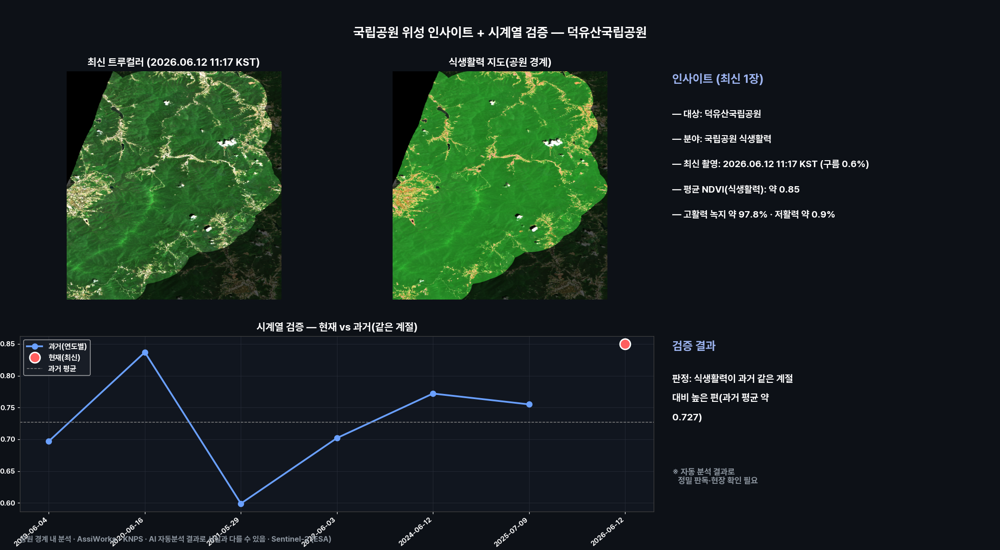
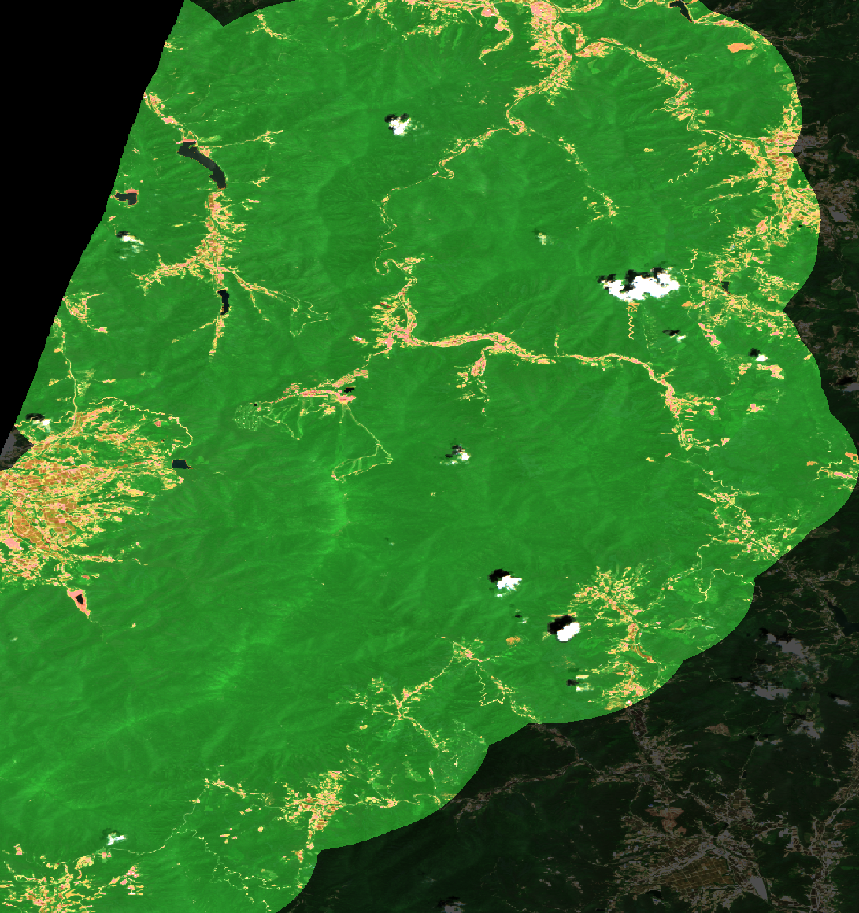
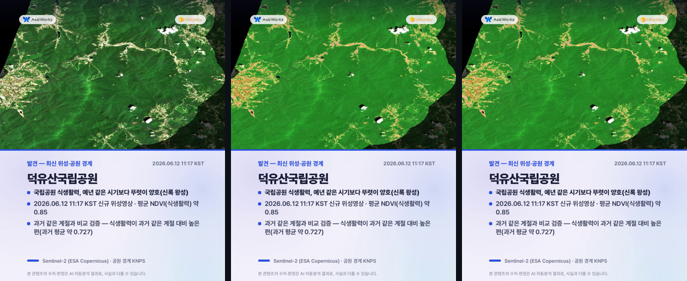
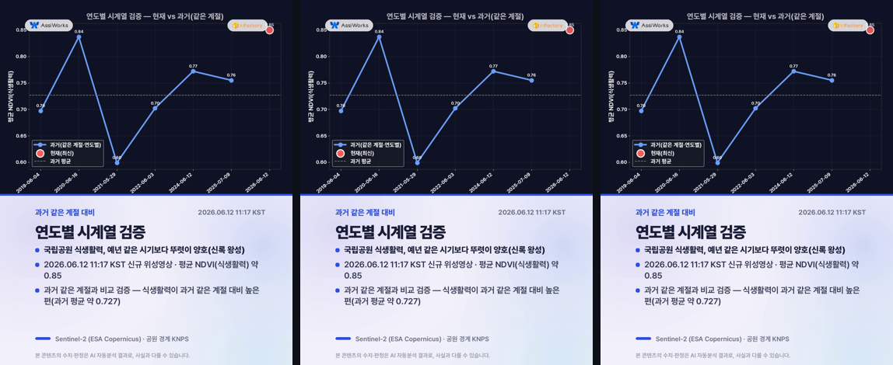
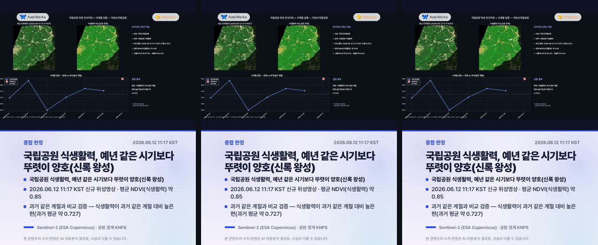

# 국립공원 위성 인사이트 — 덕유산국립공원

**발행**: 2026-06-16 02시 · **분야**: 국립공원 식생활력 · **센서**: Sentinel-2 L2A (ESA) · 10 m
**원본 촬영**: 2026.06.12 11:17 KST (구름 0.6%, 신규 위성영상) · **분석 범위**: 공원 경계(폴리곤) 내부

> ⚠️ **추정치 안내**: 본 콘텐츠의 모든 수치·판정·해석은 AI·알고리즘이 위성영상을 자동 분석한 **추정 결과**로, 사실과 다를 수 있습니다. 공식 통계·현장 확인과 차이가 있을 수 있으므로 참고용으로만 활용하시기 바랍니다.

---

## 핵심 발견
> **국립공원 식생활력, 예년 같은 시기보다 뚜렷이 양호(신록 왕성)**

## 1단계 — 발견 (최신 1장, 공원 경계 내부)
- 2026.06.12 11:17 KST 촬영 영상이 덕유산국립공원에 걸쳐, 공원 경계 안에서 식생활력(NDVI)을 분석했습니다.
- 평균 NDVI(식생활력): 약 0.85.
- 공원 경계 내 식생활력(NDVI) 평균 약 0.85 · 고활력(짙은 녹지) 약 97.8%
- 저활력 구간 약 0.9% (능선 암반·나지·시설·계절 영향 포함, 정밀 판독 필요)

## 2단계 — 시계열 검증 (같은 계절·연도별)
같은 공원의 과거 같은 계절 청천 영상(6개)과 비교해 검증합니다.
- 과거: 06-04 0.697, 06-16 0.837, 05-29 0.599, 06-03 0.702, 06-12 0.772, 07-09 0.755
- 현재: 06-12 약 0.85
- **판정: 식생활력이 과거 같은 계절 대비 높은 편(과거 평균 약 0.727)**
- ※ 자동 분석 결과로 정밀 판독·현장 확인이 필요합니다. (고사목·산사태·탐방로 훼손 등 미세 대상은 고해상 영상 병행 권장)

## 분석 종합 (발견 + 검증)

## 식생활력 지도 (공원 경계)

## 영상카드 (미리보기)

_아래는 각 영상의 대표 장면입니다. 영상은 링크에서 재생/다운로드._

▶️ [card1_discovery.mp4 영상 보기](videocards/card1_discovery.mp4)

▶️ [card2_timeseries.mp4 영상 보기](videocards/card2_timeseries.mp4)

▶️ [card3_summary.mp4 영상 보기](videocards/card3_summary.mp4)

---
_AssiWorks - KNPS · 2026-06-16 02시 · Sentinel-2 (ESA)_
