# 국립공원 위성 인사이트 — 월악산국립공원 (수질·녹조)

**발행**: 2026-06-17 14시 · **분야**: 수질·녹조 · **센서**: Sentinel-2 L2A (ESA) · 10 m
**원본 촬영**: 2026.06.17 11:17 KST (구름 7.1%, 신규 위성영상) · **분석 범위**: 공원 경계(폴리곤) 내부

> ⚠️ **추정치 안내**: 본 콘텐츠의 모든 수치·판정·해석은 AI·알고리즘이 위성영상을 자동 분석한 **추정 결과**로, 사실과 다를 수 있습니다. 공식 통계·현장 확인과 차이가 있을 수 있으므로 참고용으로만 활용하시기 바랍니다.

---

## 핵심 발견
> **녹조 신호 탐지 — 수역 약 9.3%**

## 1단계 — 발견 (최신 1장, 공원 경계 내부)
- 2026.06.17 11:17 KST 촬영 영상이 월악산국립공원에 걸쳐, 공원 경계 안에서 수질·녹조(수역 평균 NDCI(녹조))을(를) 분석했습니다.
- 수역 평균 NDCI(녹조): 약 -0.118.
- 수역 내 녹조 의심 약 9.3%
- 보 배후·완류 구간 신호 집중 점검

## 2단계 — 시계열 검증 (같은 계절·연도별)
같은 공원의 과거 같은 계절 청천 영상(3개)과 비교해 검증합니다.
- 과거: 05-23 0.004, 05-19 -0.048, 06-16 0.022
- 현재: 06-17 약 -0.118
- **판정: 녹조 신호가 과거 대비 낮은 편(과거 평균 약 -0.007)**
- ※ 자동 분석 결과로 정밀 판독·현장 확인이 필요합니다.

## 분석 종합 (발견 + 검증)
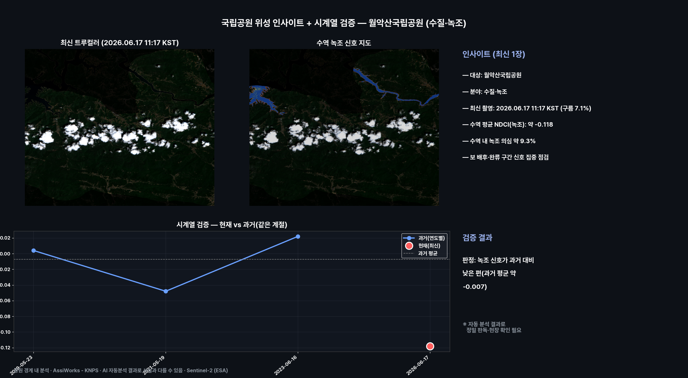

## 수역 녹조 신호 지도
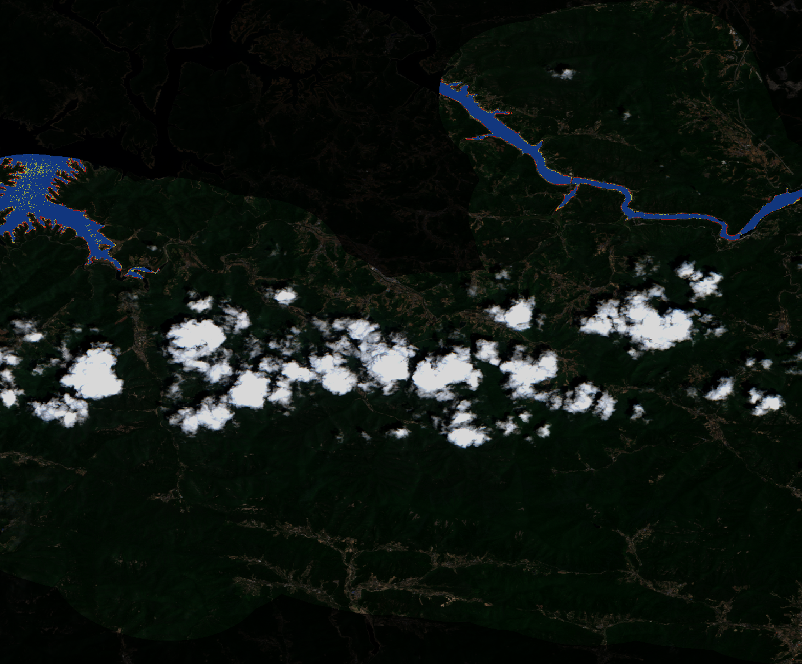

## 연도별 과거 영상 (같은 계절 · 공원 경계)
같은 공원을 해마다 같은 계절에 촬영한 트루컬러 위성영상입니다(각 이미지에 촬영 시각 표기). 리포트에서 바로 과거와 현재를 비교해 보세요.

**2020.06.08 11:17 KST**

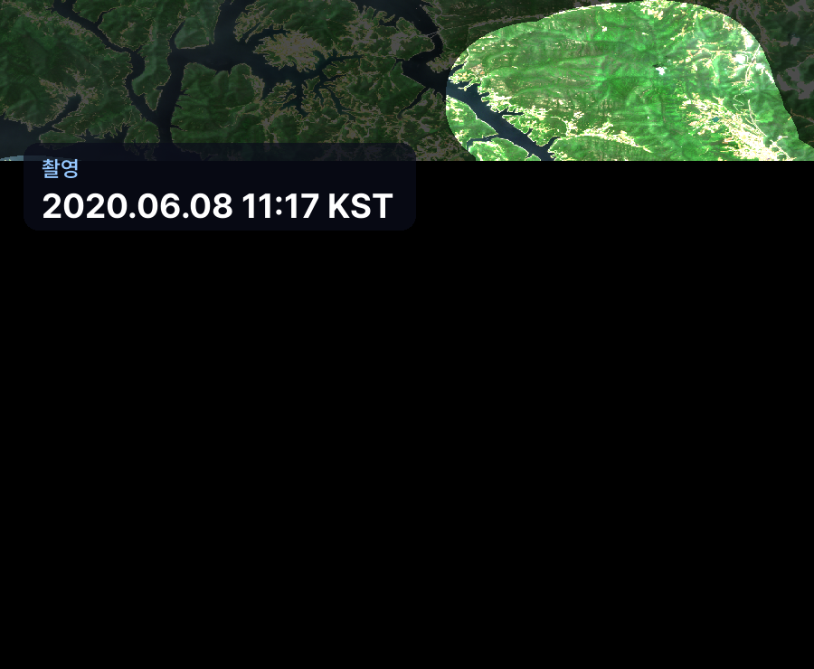

**2021.05.19 11:17 KST**

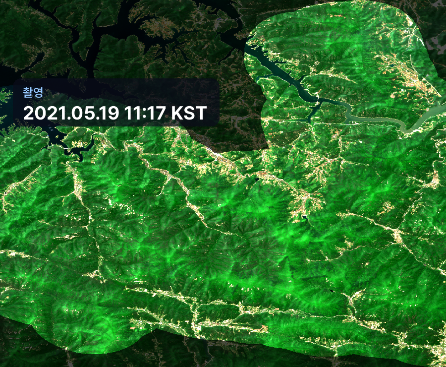

**2022.05.17 11:27 KST**

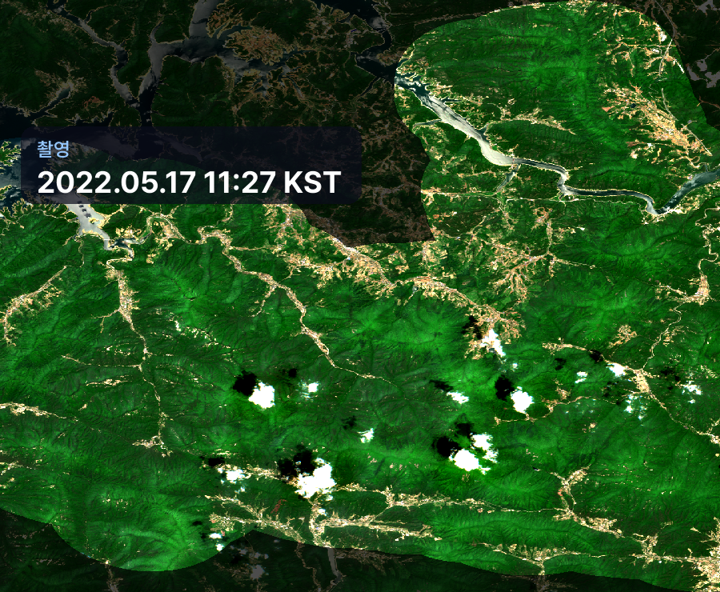

**2023.06.16 11:27 KST**

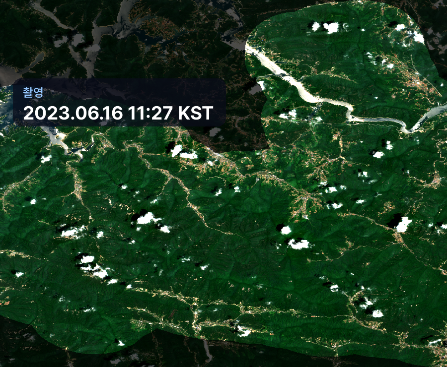

**2024.05.23 11:17 KST**

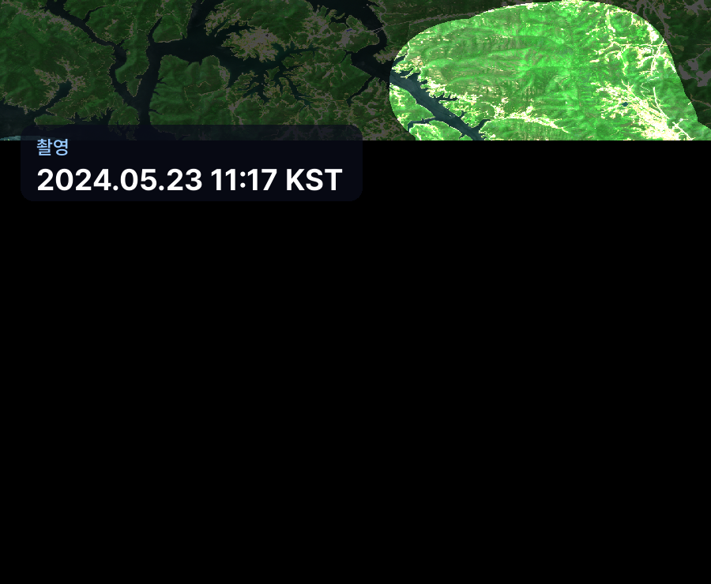

**2025.07.10 11:27 KST**

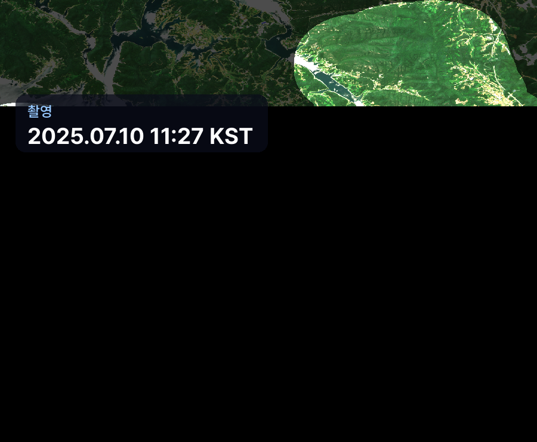

**2026.06.17 11:17 KST**

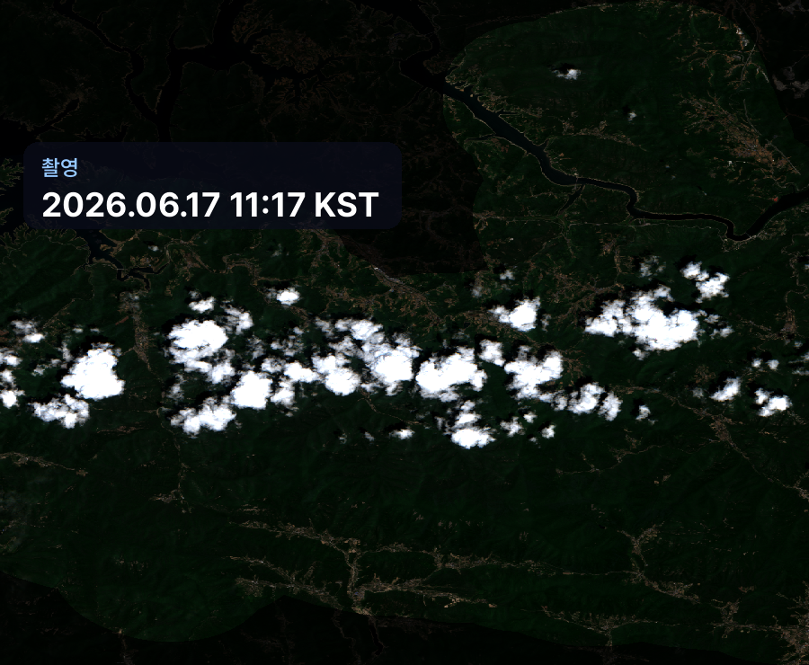

## 영상카드 (미리보기)

_아래는 각 영상의 대표 장면입니다. 영상은 링크에서 재생/다운로드._

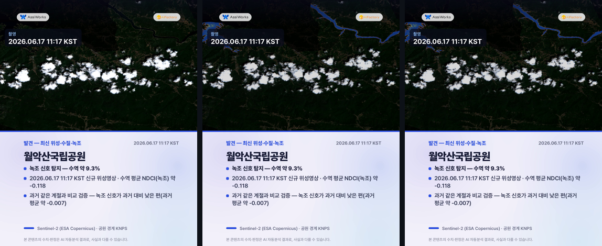
▶️ [card1_discovery.mp4 영상 보기](videocards/card1_discovery.mp4)

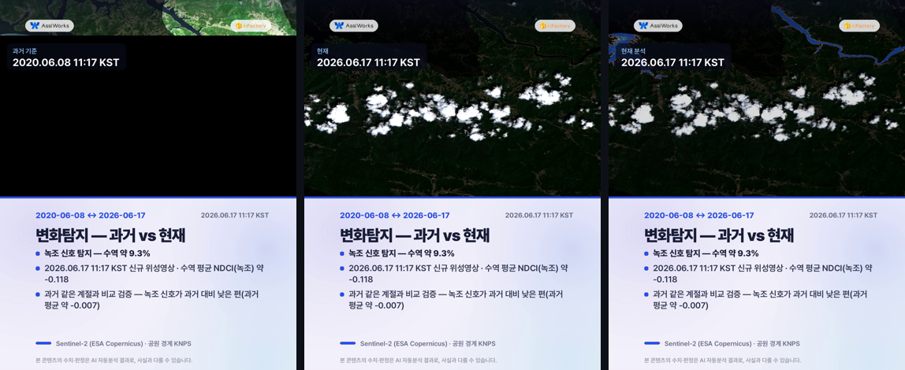
▶️ [card_change.mp4 영상 보기](videocards/card_change.mp4)

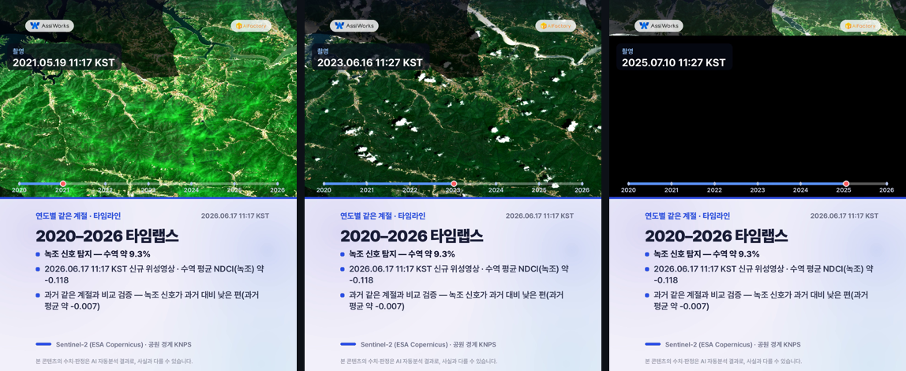
▶️ [card_timelapse.mp4 영상 보기](videocards/card_timelapse.mp4)

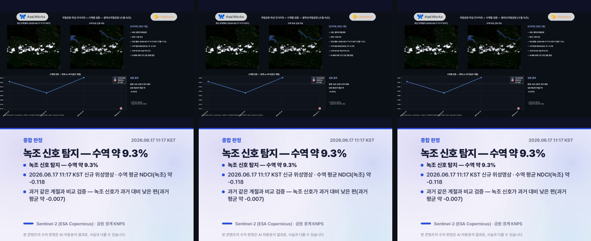
▶️ [card4_summary.mp4 영상 보기](videocards/card4_summary.mp4)

---
_AssiWorks - KNPS · 2026-06-17 14시 · Sentinel-2 (ESA)_
